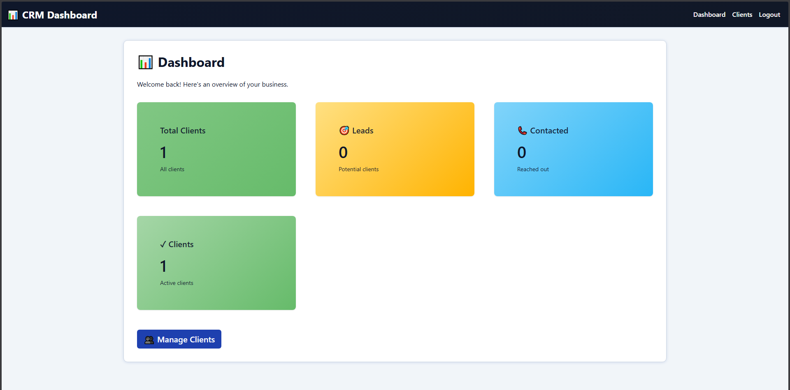
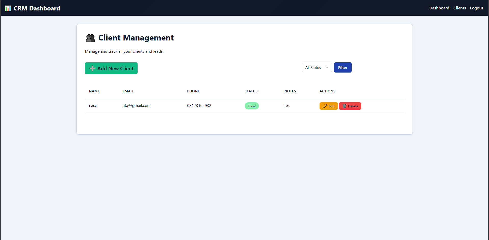

<div align="center">

<br/>

```
   ██████╗██████╗ ███╗   ███╗    ██████╗  █████╗ ███████╗██╗  ██╗
  ██╔════╝██╔══██╗████╗ ████║    ██╔══██╗██╔══██╗██╔════╝██║  ██║
  ██║     ██████╔╝██╔████╔██║    ██║  ██║███████║███████╗███████║
  ██║     ██╔══██╗██║╚██╔╝██║    ██║  ██║██╔══██║╚════██║██╔══██║
  ╚██████╗██║  ██║██║ ╚═╝ ██║    ██████╔╝██║  ██║███████║██║  ██║
   ╚═════╝╚═╝  ╚═╝╚═╝     ╚═╝    ╚═════╝ ╚═╝  ╚═╝╚══════╝╚═╝  ╚═╝
```

### A clean, efficient CRM Dashboard built with Laravel

<br/>

[](https://laravel.com)
[](https://php.net)
[](https://mysql.com)
[](LICENSE)

<br/>

[Features](#-features) · [Demo](https://dashboard-production-0bde.up.railway.app) · [Quick Start](#-quick-start) ·

<br/>

</div>

---

## 📌 About

**CRM Dashboard** adalah aplikasi manajemen klien yang ringan dan responsif, dibangun menggunakan **Laravel**. Dirancang untuk membantu bisnis skala kecil hingga menengah dalam melacak status klien, mencatat interaksi, dan memantau pipeline penjualan — semuanya dalam satu antarmuka yang bersih.

> 💡 Proyek ini dibangun sebagai portofolio sekaligus implementasi nyata sistem CRM sederhana berbasis web.

---

## ✨ Features

| Fitur | Deskripsi |
|-------|-----------|
| 🔐 **Authentication** | Login khusus admin, aman dan terproteksi |
| 📊 **Dashboard Overview** | Ringkasan statistik: Total Klien, Leads, Contacted, Active |
| 👥 **Client Management** | CRUD lengkap — tambah, edit, hapus, dan catat klien |
| 📝 **Notes & Comments** | Simpan catatan interaksi untuk setiap klien |
| 📌 **Status Tracking** | Pantau status klien: `Lead` → `Contacted` → `Client` |
| 🔍 **Filter by Status** | Saring tampilan klien berdasarkan status dengan mudah |
| 📱 **Responsive UI** | Tampilan bersih dan adaptif di semua ukuran layar |

---

## 🛠️ Tech Stack

```
Backend   →  Laravel (PHP)
Database  →  PostgreSQL (Supabase)
Frontend  →  Blade Templates + CSS
Dev Env   →  Laragon
```

---

## 🚀 Quick Start

### Prerequisites
Pastikan kamu sudah menginstal:
- PHP `>= 8.1`
- Composer
- [Supabase Account](https://supabase.com) (PostgreSQL)
- Laragon

### 1. Clone Repository
```bash
git clone https://github.com/kkornelius/Dashboard.git
cd Dashboard
```

### 2. Install Dependencies
```bash
composer install
```

### 3. Setup Environment
```bash
cp .env.example .env
php artisan key:generate
```

### 4. Konfigurasi Database

Pilih salah satu opsi sesuai kebutuhanmu:

---

#### 🖥️ Opsi A — Local Development (MySQL / PostgreSQL Lokal)

Cocok kalau kamu hanya ingin menjalankan proyek ini secara lokal.
```env
# MySQL (via Laragon / XAMPP)
DB_CONNECTION=mysql
DB_HOST=127.0.0.1
DB_PORT=3306
DB_DATABASE=crm_db
DB_USERNAME=root
DB_PASSWORD=

# Atau PostgreSQL lokal
DB_CONNECTION=pgsql
DB_HOST=127.0.0.1
DB_PORT=5432
DB_DATABASE=crm_db
DB_USERNAME=postgres
DB_PASSWORD=your-local-password
```

---

#### ☁️ Opsi B — Supabase (PostgreSQL Cloud)

Gunakan opsi ini kalau kamu ingin deploy atau terhubung ke database yang sama dengan demo live.

Login ke [supabase.com](https://supabase.com), buka proyekmu, lalu pergi ke:
**Project Settings → Database → Connection String → PHP (PDO)**
```env
DB_CONNECTION=pgsql
DB_HOST=aws-0-<region>.pooler.supabase.com
DB_PORT=6543
DB_DATABASE=postgres
DB_USERNAME=postgres.<project-ref>
DB_PASSWORD=your-supabase-password
```

> ⚠️ Ganti `<region>`, `<project-ref>`, dan `your-supabase-password` sesuai kredensial di dashboard Supabase kamu.

### 5. Jalankan Migrasi
```bash
php artisan migrate
```

> Opsional — jalankan seeder jika tersedia:
> ```bash
> php artisan db:seed
> ```

### 6. Jalankan Server
```bash
php artisan serve
```

🌐 Akses aplikasi di: **[http://127.0.0.1:8000](http://127.0.0.1:8000)**
---


## 📸 Screenshots

### Dashboard Overview
> Tampilan ringkasan statistik klien secara real-time.


### Client Management
> Kelola data klien dengan operasi CRUD yang lengkap.

  

---


## 👨‍💻 Author

<div align="center">

[](https://github.com/kkornelius)

</div>

---

## 📄 License

Proyek ini open-source dan tersedia di bawah lisensi **[MIT](LICENSE)**.

---

<div align="center">

Dibuat dengan ❤️ menggunakan Laravel

⭐ Jangan lupa kasih **star** kalau proyek ini bermanfaat!

</div>
